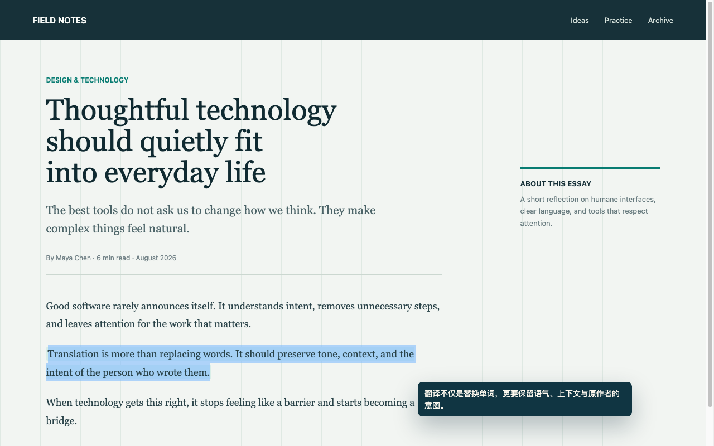
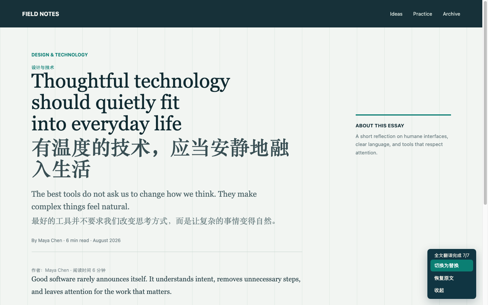
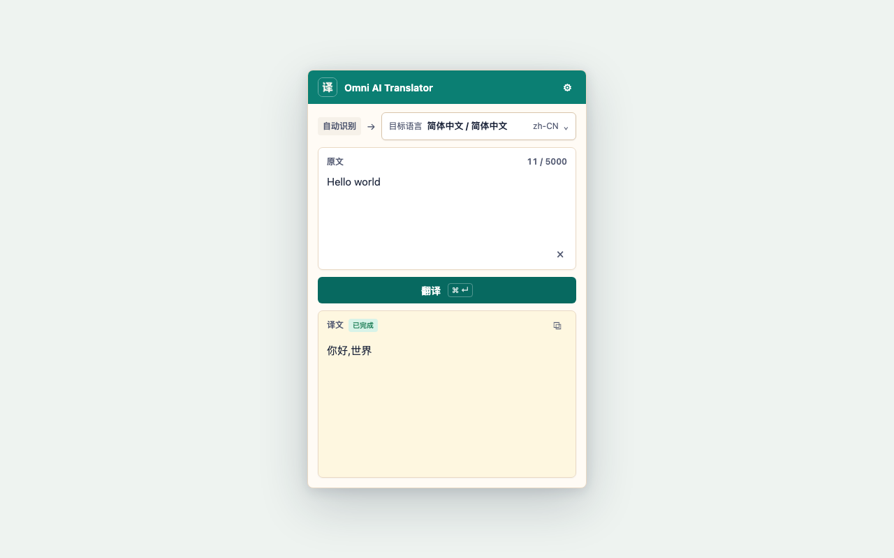
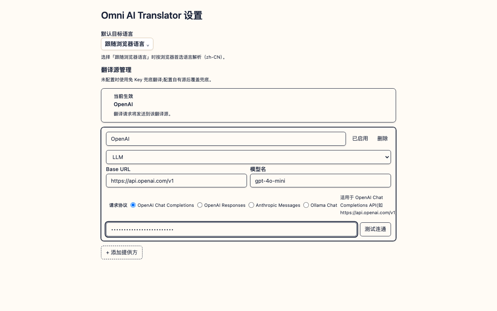

<p align="center">
  
</p>

<h1 align="center">Omni AI Translator</h1>

<p align="center">
  一款 AI 驱动的浏览器翻译扩展。划词、整页或直接输入文本，都能在当前页面快速获得译文。
</p>

<p align="center">
  <a href="https://chromewebstore.google.com/detail/omni-ai-translator/hlnagbpimgifinglmfbmkgaooneplpli">Chrome 插件下载</a>
  ·
  <a href="#主要功能">主要功能</a>
  ·
  <a href="https://aiden-fe.github.io/omni-ai-translator/privacy/">隐私政策</a>
</p>

Omni AI Translator 默认提供免 Key 翻译源，安装后即可使用；也可以连接 OpenAI、Anthropic、Ollama 或其他兼容接口，在翻译质量、速度和数据去向之间自行选择。

## 主要功能

### 划词翻译

选中网页中的文字，点击旁边出现的「译」按钮，即可在原文附近查看译文，不需要离开当前页面。



### 全文翻译

在网页空白处点击右键，选择「全文翻译」，可以替换原文，也可以保留原文并显示双语对照。右下角工具栏可随时切换模式或恢复原文。



### 文本翻译

点击浏览器工具栏中的扩展图标，直接输入或粘贴文本。支持自动识别原文语言、临时切换目标语言、流式显示结果和一键复制。



### 灵活的翻译源配置

无需 API Key 也能使用内置翻译源；需要更高质量或更强隐私控制时，可切换到自己的云端模型、本地 Ollama、Google 翻译或微软翻译接口。



## 安装

### Chrome

1. 打开 [Omni AI Translator 的 Chrome 网上应用店页面](https://chromewebstore.google.com/detail/omni-ai-translator/hlnagbpimgifinglmfbmkgaooneplpli)。
2. 点击「添加至 Chrome」，并在浏览器提示中确认安装。
3. 建议将 Omni AI Translator 固定到浏览器工具栏，方便使用文本翻译。

### Microsoft Edge

打开 [最新 Release](https://github.com/Aiden-FE/omni-ai-translator/releases/latest)，下载名称以 `edge.zip` 结尾的安装包并解压；然后在 `edge://extensions/` 中开启「开发人员模式」，加载解压目录。

### Firefox

Release 中同时提供 `firefox.zip` 构建包。未签名的扩展需要在 `about:debugging#/runtime/this-firefox` 中选择「临时载入附加组件」，并打开压缩包内的 `manifest.json`；重启 Firefox 后需要重新载入。

> 浏览器设置页、扩展商店等受保护页面不允许扩展注入脚本，因此这些页面无法使用划词或全文翻译。

## 开始使用

安装完成后，不做额外配置也可以直接翻译：

1. **翻译一段网页文字**：选中文字，再点击浮动的「译」按钮。
2. **翻译整个网页**：在页面空白处点击右键，依次选择「全文翻译」和所需模式。
3. **翻译独立文本**：点击扩展图标，在文本框中输入内容后点击「翻译」。
4. **更改默认语言**：点击扩展右上角的设置按钮，在「默认目标语言」中选择语言。

全文翻译完成后，可通过右下角工具栏在「替换」与「双语对照」之间切换；点击「恢复原文」即可清除本次整页翻译结果。

## 配置自己的翻译源

点击扩展右上角的设置按钮，再选择「配置自有源」或「打开全部设置」。添加翻译源后填写接口信息，点击「测试连通」，确认成功后点击「启用」。

| 类型 | 适用场景 | 需要填写 |
| --- | --- | --- |
| 免 Key 翻译 | 开箱即用 | 无 |
| OpenAI Chat Completions | OpenAI 或兼容服务 | Base URL、模型名、API Key |
| OpenAI Responses | OpenAI Responses API | Base URL、模型名、API Key |
| Anthropic Messages | Claude 原生接口 | Base URL、模型名、API Key |
| Ollama Chat | 在本机运行模型 | Ollama 地址、模型名；通常不需要 Key |
| Google / 微软翻译 | 传统机器翻译服务 | 可免 Key 使用兜底，也可填写官方 API 配置 |

同一时间只有一个翻译源生效。API Key 仅保存在浏览器本地存储中，不会发送到本项目的服务器。

## 使用翻译加速

翻译加速是一个**可选且默认关闭**的性能层：开启后，插件在翻译前会先向加速节点查询缓存，命中的直接展示；未命中的照常翻译，翻译完成后把结果写回缓存供后续使用。

在设置页的「翻译加速」区域有三种选择：

| 选项 | 说明 |
| --- | --- |
| 不使用加速（默认） | 行为与以前完全一致 |
| 官方加速节点 | 由项目方运营的公共加速服务 |
| 自定义节点地址 | 填入你自己部署的加速节点地址 |

加速范围默认**仅免 Key 内置翻译源**——你的自有源原文不会外发到加速节点；需要时可主动改为「所有翻译源」。

加速节点能看到被翻译的原文，但**不会**收到你的 API Key：加速服务只做缓存、不做代理，从设计上就不接收任何翻译接口凭据。第三方节点由第三方运营、可以返回任意内容作为译文，配置第三方地址时插件会明确提示这一点。

想自建加速节点？[自建部署指南](https://aiden-fe.github.io/omni-ai-translator/relay/) 提供 docker-compose 快速部署、环境变量说明与 HTTP API 参考。

## 隐私说明

- 翻译文本会发送给当前启用的翻译服务，以完成翻译。
- 使用免 Key 翻译时，文本会发送到 Google 或微软的公共翻译端点。
- 使用自定义翻译源时，文本和所需鉴权信息会直接发送到你配置的接口。
- 配置、默认目标语言和 API Key 保存在浏览器本地；扩展不会保存文本翻译历史。
- 翻译加速默认关闭；启用后，待翻译原文会发往你所选的加速节点（含官方节点），但 API Key 始终只留在本地。详见[隐私政策](https://aiden-fe.github.io/omni-ai-translator/privacy/)的第 4 节。

请在处理敏感内容前确认所选翻译服务的数据政策。完整说明请阅读[隐私政策](https://aiden-fe.github.io/omni-ai-translator/privacy/)。

## 本地开发

```bash
pnpm install
pnpm dev
```

常用命令：

```bash
pnpm build        # 构建 Chrome 扩展
pnpm test         # 运行单元测试
pnpm e2e          # 构建并运行 Chromium 端到端测试
pnpm typecheck    # TypeScript 类型检查
pnpm screenshots  # 重新生成 README 产品截图
```

开发服务器启动后，按照 WXT 的终端提示加载 `.output` 中的开发构建。Chrome、Edge 和 Firefox 的独立构建命令可在 [`package.json`](package.json) 中查看。

### Relay 本地开发

如需带真实 Redis 调试 `@omni/relay`，可使用专用开发 compose 启动 Redis，宿主直接运行 relay（增量编译 + 自动重启）：

```bash
pnpm install
docker compose -f docker-compose.dev.yml up -d redis
REDIS_URL=redis://127.0.0.1:16379 pnpm --filter @omni/relay dev
```

Redis 默认映射到宿主 `16379` 端口，避免与本机已有 Redis 冲突。清理开发环境：

```bash
docker compose -f docker-compose.dev.yml down --volumes
```

## 反馈与贡献

遇到问题或希望增加新的翻译能力，请提交 [GitHub Issue](https://github.com/Aiden-FE/omni-ai-translator/issues)。反馈时建议附上浏览器版本、扩展版本、翻译源类型和可复现步骤；请勿提交真实 API Key 或敏感原文。
