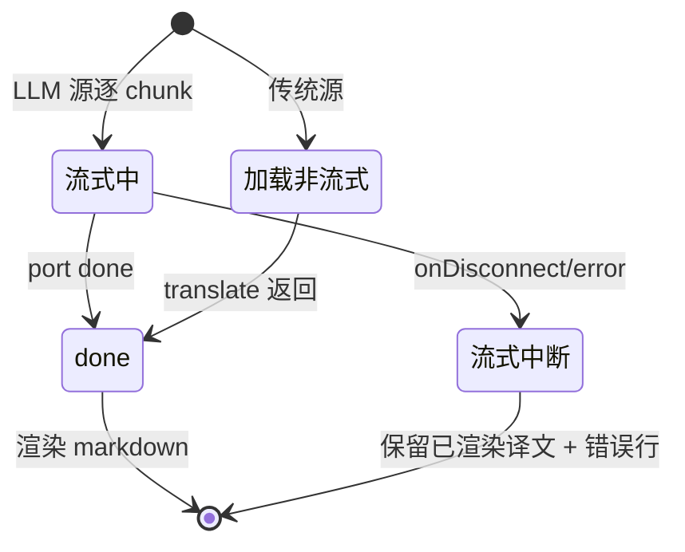

# 翻译浮层译文 markdown 可读渲染

## 功能目标

将翻译浮层的译文渲染从纯文本（`textContent`）升级为 markdown 可读渲染，使 LLM 译文中的标题/列表/加粗/代码块等结构化内容以可读格式呈现；流式期间保持渐进显示，done 后渲染最终 markdown，并对不可信 LLM 输出做 XSS sanitize。

## 业务规则

- 仅 LLM 源（openai-compatible / anthropic / ollama）译文可能含 markdown；传统源（google / microsoft）译文为纯文本，渲染为段落。
- 流式期间保持 `textContent` 渐进显示 + 光标（不中途渲染半截 md，避免抖动）；done 后切换为 `renderMarkdown` → `innerHTML`。
- sanitize 必须清除：`<script>`（含内容）、`on*` 事件属性、`javascript:` 链接、`<iframe>` / `<object>` / `<embed>`、`data:` URL。
- 保留的链接强制 `target="_blank"` + `rel="noopener noreferrer"`（`afterSanitizeAttributes` hook）。
- 后端 `buildPrompt` 追加指示「若源文为 markdown，保留其结构与标记（标题/列表/代码块）」，三源（openai/anthropic/ollama）统一生效。
- 浮层暗底 `#1F2937` + 浅字 `#F9FAFB`；最大宽 360px；代码块稍浅底 `#374151` + 等宽字体 + 横向滚动。

## 状态流转

浮层渲染态在 v0.2 流式基础上细化 done 渲染：

- **流式中**（LLM 源）：`textContainer.textContent` 逐 chunk 追加 + 闪烁光标 `▋`（不变）。
- **done**：移除光标 span，创建 `div.llm-translator-md-render`，`renderMarkdown(translatedText)` 产出 sanitize 后的 HTML 注入。
- **错误**：保留现有四类 `errorType` 反馈（❌ 前缀），不受 markdown 渲染影响。

## 权限控制

- 无新增权限；渲染在 content script 内进行，沿用既有权限。
- LLM 译文为不可信输入，必须经 DOMPurify sanitize 后才注入 DOM。

## UI 或交互要点

- 渲染点：`entrypoints/content.ts` done 处理，将 `textContainer.textContent = translatedText` 替换为 `renderMarkdown(translatedText)`；流式阶段 `textContent` 渐进保持不变。
- md 元素语义化：`h1-h6` / `ul` / `ol` / `li` / `code` / `pre` / `blockquote` / `a`，供读屏识别结构。
- 浮层容器 `aria-live="polite"` 在 done 渲染后播报最终译文。
- 代码块横向滚动，md 元素在 360px 内换行；暗底浅字对比度满足 AA。
- 流式→done 切换无闪烁（光标 span 移除与 md 注入在同一次更新）。

## 相关文件

- `shared/render/markdown.ts` — `renderMarkdown`（轻量解析器 + DOMPurify sanitize）
- `shared/render/__tests__/markdown.test.ts` — sanitize 恶意 payload 单测（28 例）
- `entrypoints/content.ts` — done 阶段接入 `renderMarkdown`，流式阶段不变
- `assets/content.css` — `.llm-translator-md-render` 暗底 md 样式
- `shared/translator/llm-provider.ts` — `buildPrompt` 追加保留 markdown 结构指示
- `package.json` — 新增 `dompurify`（production）、`jsdom`（dev）
- `knowledges/adr/003-markdown-render-sanitize.md` — 依赖选型决策
- `knowledges/context/development/dompurify-lazy-init.md` — DOMPurify 懒初始化

## 相关模块

- [LLM 翻译流式响应](streaming.md) — 流式渐进渲染、port 协议、done 阶段衔接基础
